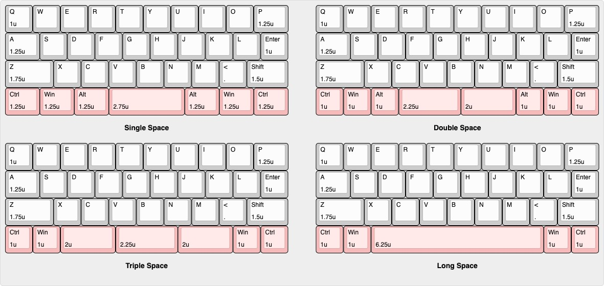
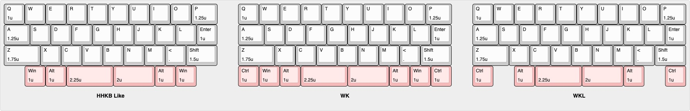

# QAZ BLE

QAZ BLE は、[**QAZ Keyboard**](https://www.cbkbd.com/product/qaz) および [**PBS MV Classic**](https://mvkb.com/classic-pbs/)に影響を受け設計されたキーボードです。

Seeeduino XIAO nRF52840 を採用し、 無線接続に対応したQAZレイアウトのキーボードです。

## 目次

1. [特徴](#特徴)
2. [レイアウト](#レイアウト)
3. [ファームウェア](#ファームウェア)
4. [ビルドガイド](#ビルドガイド)
5. [ケース](#ケース)
6. [ライセンス](#ライセンス)

## 特徴

* **レイアウト互換**: オリジナル QAZ Keyboard をベースに複数レイアウト（後述）へ対応
* **柔軟なコネクタ配置**: キースイッチ部とマイコン部を FFC で接続しているため、USB‑C 位置を自由に変更可能（※要ケースの修正）
* **XIAO シリーズ互換**: XIAO nRF52840 (ZMK) を標準サポートしていますが、フットプリントが共通のため XIAO RP2040 (QMK/ZMK)も利用いただけます。
* **拡張性**: XIAO Adapter では SWCLK/SWDIO を除く全ピンを FFC に配線。キースイッチ部を差し替えるだけで他のキースイッチ基板へも容易に移植可能(今後制作するかは未定です…)

## レイアウト

下段レイアウトは以下の組み合わせに対応

※各レイアウト同士は一部キースイッチに干渉してしまうため、キーソケットはいずれかのレイアウトを選ぶ必要があります。
| レイアウト | 各キーのサイズ |
| :------: | :----------: |
| Single Space | 1.25u/1.25u/1.25u/2.75u/1.25u/1.25u/1.25u|
| Double Space | 1u/1u/1u/2.25u/2u/1u/1u/1u/ |
| Triple Space | 1u/1u/2u/2.25u/2u/1u/1u |
| Long Space   | 1u/1u/6.25u/1u/1u |

各レイアウトは対応するキーを未実装にすることでWK/WKL/HHKBライクにすることもできます。(ファームウェア上で対応するキーは反応しないようになります。)

## ファームウェア

| ファームウェア | 対応マイコン | ソースコード |
|:--|:--|:--|
| ZMK | XIAO nRF52840 / XIAO nRF52840 Plus / XIAO RP2040 | [zmk-config-qaz-ble](https://github.com/tennis-n1010/zmk-config-qaz-ble) |
| QMK | XIAO RP2040 | [qmk_firmware](https://github.com/tennis-n1010/qmk_firmware/tree/master/keyboards) |
| QMK(VIA対応) | XIAO RP2040 | [qmk_firmware](https://github.com/tennis-n1010/qmk_firmware/tree/master/keyboards)(QMK本体),  [qmk_userspace_via](https://github.com/tennis-n1010/qmk_userspace_via)(via.json),  [keyboards](https://github.com/tennis-n1010/keyboards)(keyboard.json) |
| QMK(Vial対応) | XIAO RP2040 | [vial-qmk](https://github.com/tennis-n1010/vial-qmk) |

各ファームウェアのビルド済みファイルはリリースからダウンロードしてください。

## ビルドガイド

[`docs/buildguide.md`](https://github.com/tennis-n1010/qaz-ble/blob/main/docs/buildguide.md) を参照

## ケース

お持ちの3DプリンタまたはJLC 3D プリント等のサービスをご利用ください。

STEPファイル は `hardware/case/` を参照

## ライセンス

* **ハードウェア (STEPファイル)**: CERN‑OHL‑P v2
* **ファームウェア**: 
  * **ZMK**: MIT
  * **QMK**: GPL-2.0
* **ドキュメント / 画像**: Creative Commons BY‑SA 4.0

## Images

