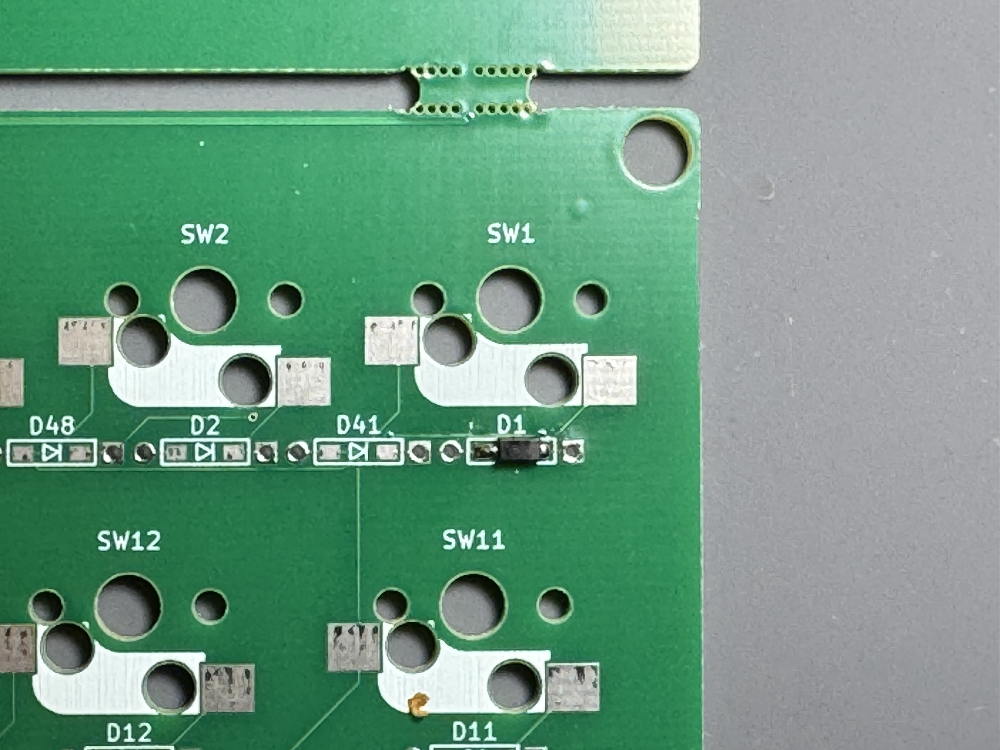
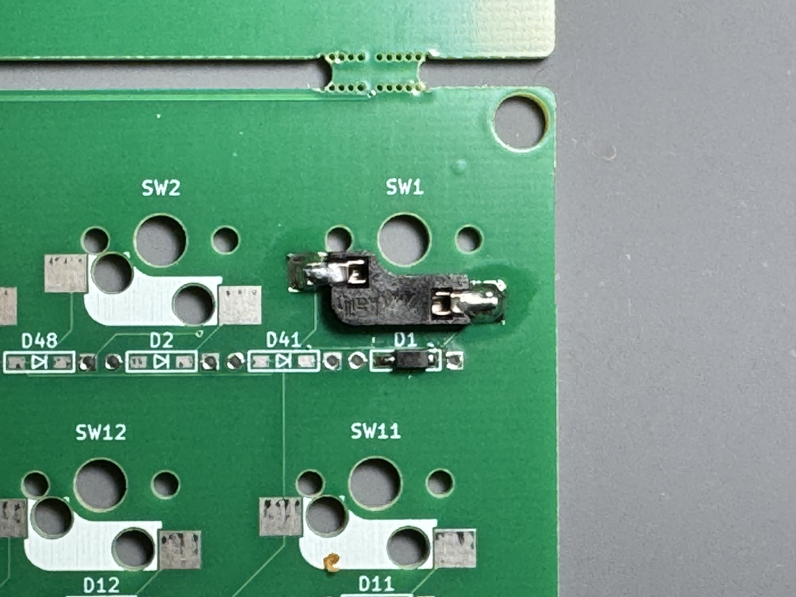
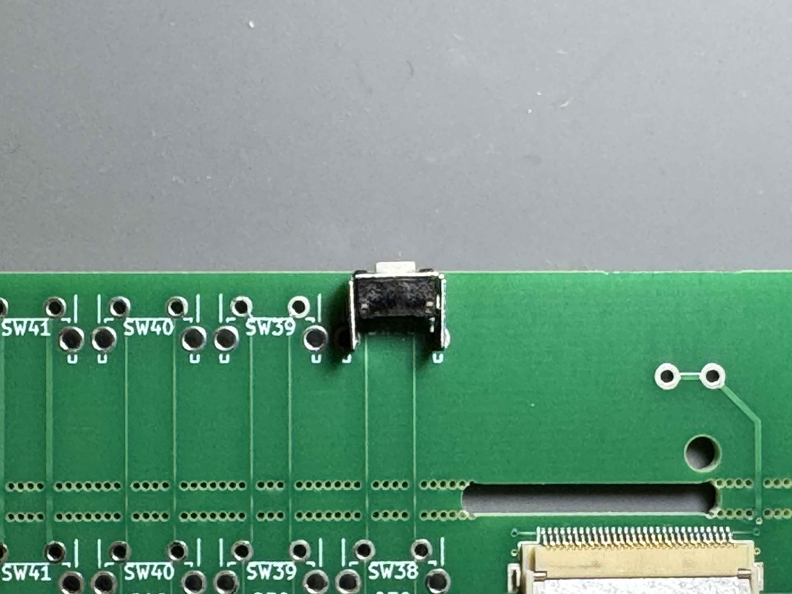
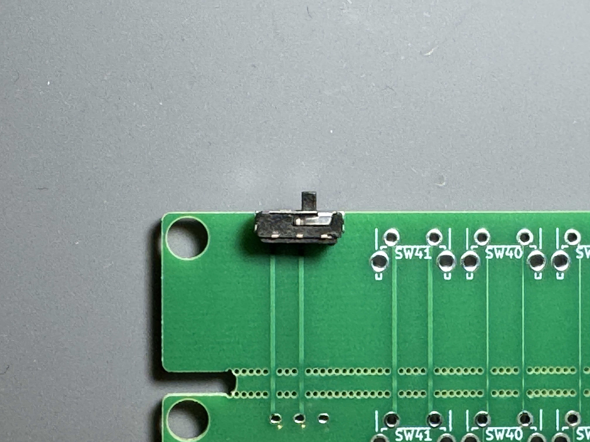
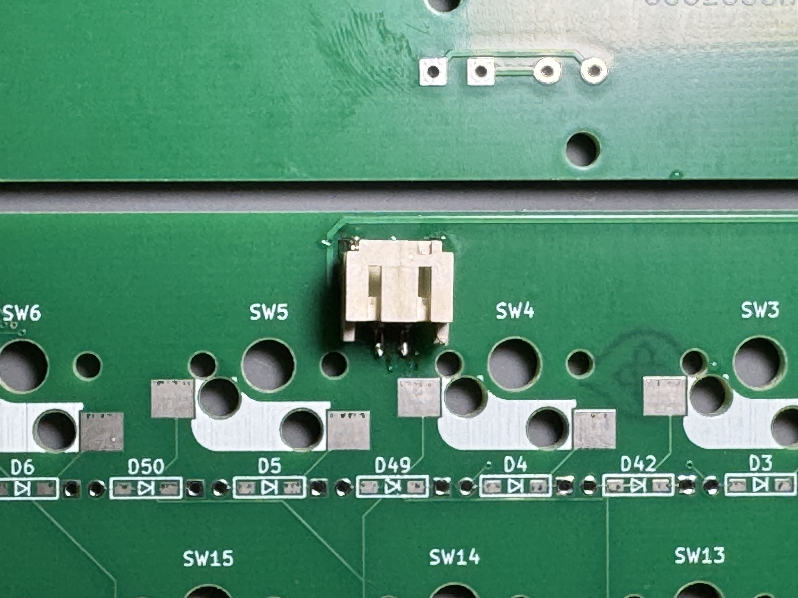
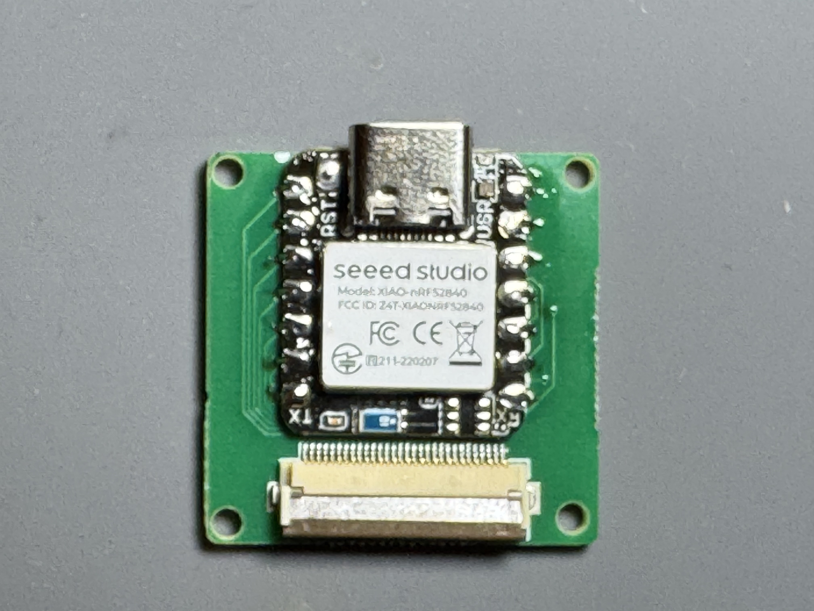
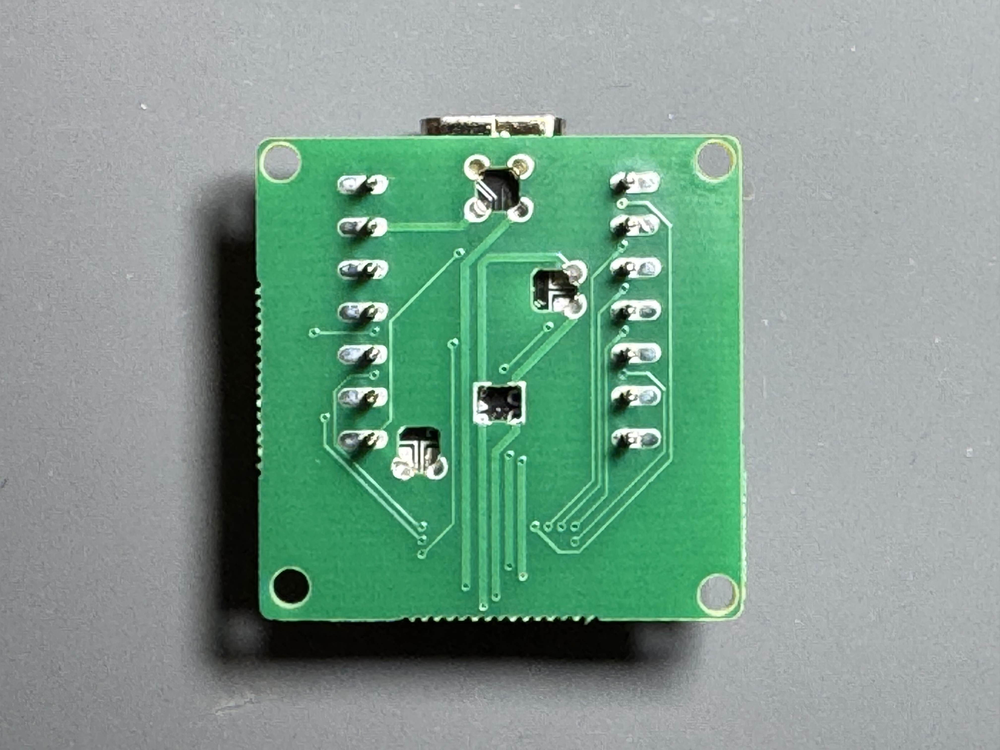
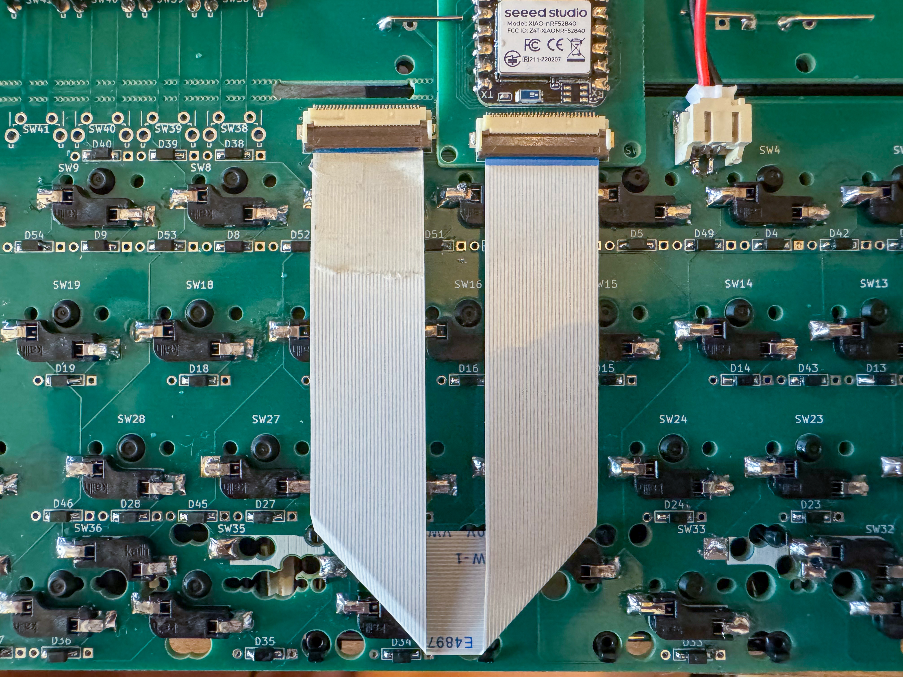
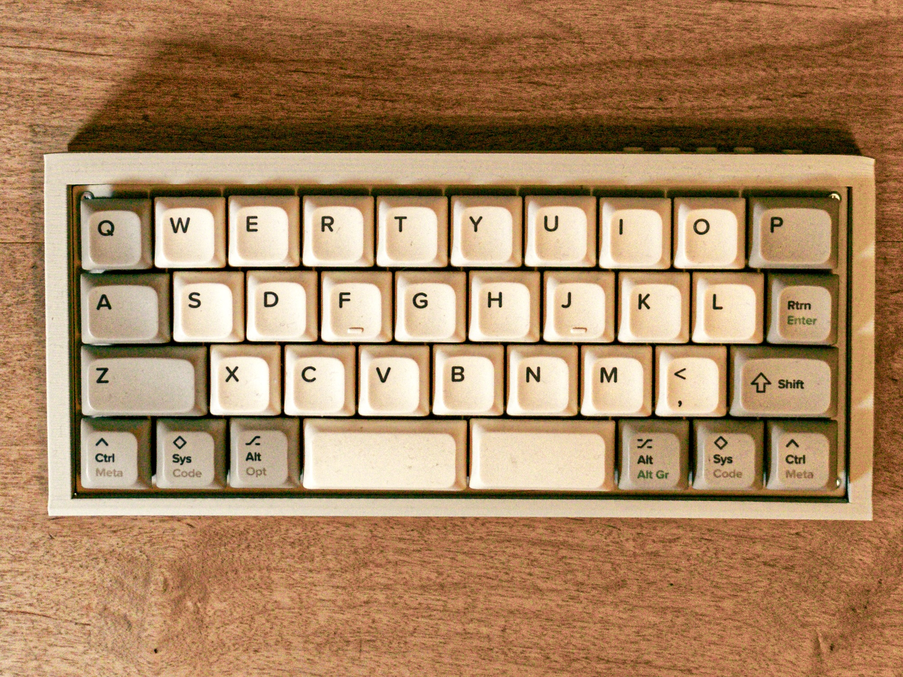

# QAZ BLE ビルドガイド

## 【目次】

  - [０．はじめに](#０はじめに)
    - [0-1．Charlieplex配列について](#0-1charlieplex配列について)
    - [0-2．電池による使用について](#0-2電池による使用について)
  - [１．部品確認と準備](#１部品確認と準備)
    - [1-1．QAZ BLE必要部品](#1-1qaz-ble必要部品)
    - [1-2．QAZ NUM BLE必要部品](#1-2qaz-num-ble必要部品)
    - [1-3．その他準備いただく部品](#1-3その他準備いただく部品)
    - [1-4．必要な工具](#1-4必要な工具)
    - [1-5．ファームウェア](#1-5ファームウェア)
  - [２．実装](#２実装)
    - [2-0．作業前の注意事項](#2-0作業前の注意事項)
    - [2-1．ダイオードの取り付け](#2-1ダイオードの取り付け)
    - [2-2．キーソケットのはんだ付け](#2-2キーソケットのはんだ付け)
    - [2-3．タクタイルスイッチのはんだ付け](#2-3タクタイルスイッチのはんだ付け)
    - [2-4．スライドスイッチのはんだ付け](#2-4スライドスイッチのはんだ付け)
    - [2-5．PHコネクタのはんだ付け](#2-5phコネクタのはんだ付け)
    - [2-6．XIAOアダプタへのマイコン取り付け](#2-6xiaoアダプタへのマイコン取り付け)
  - [３．組み立て](#３組み立て)
    - [3-1．FFCケーブルの接続](#3-1ffcケーブルの接続)
    - [3-2．動作確認](#3-2動作確認)
    - [3-3．ケースの組み立て](#3-3ケースの組み立て)
  - [４．ファームウェアの書き込み](#４ファームウェアの書き込み)
  - [５．完成](#５完成)
  - [６．トラブルシューティング](#６トラブルシューティング)

## ０．はじめに

### 0-1．Charlieplex matrixについて

このキーボードはCharlieplex matrixまたは省電力版改良二乗マトリクス(省電力版総当たりマトリクス)、Low Power Improved Square(Round Robin) Matrixなどと呼ばれる配線を採用しています。回路中のVthとVfが動作に影響を与える可能性があります(ゴーストの発生等)。そのためダイオードの個体差等考慮する必要があります。

配線方式に関する技術的な詳細については以下のリンクを参照してください。

- [キーボードのマトリクス方式の分類](https://blog.ikejima.org/make/keyboard/2019/12/14/keyboard-circuit.html)
- [変則マトリクスキーボード設計](https://blog.ikejima.org/make/keyboard/2022/12/07/atypical-matrix-design.html)
- [Forward voltage calculations](https://kbd.news/forward-voltage-calculations-1416.html)
- [Improved square matrix](https://kbd.news/Improved-square-matrix-1415.html)
- [Low Power Improved Square Matrix](https://kbd.news/Low-Power-Improved-Square-Matrix-1810.html)

### 0-2．電池による使用について

このキーボードQAZ BLEは5Rowビルドにすることでリポバッテリーの代わりにNiMH電池を使用することができます。ただし、NiMH電池使用時には以下の点に注意してください。

**注意事項:**
- NiMH電池使用時は専用の電池ケースを使用してください
- 単4×1ケースを2つまたは単3×1ケースを2つ実装できるように設計されています
- ピンタイプの電池ケースをご使用ください
- NiMH電池使用時はUSB接続をしないでください
- 長時間使用しない場合は電池を外してください

**参考リンク:**
- [Seeed XIAO nRF52840をNiMH電池で動かす一方法（の中間報告）【2025/02/08追記・2025/04/22補足】: パドラッパ](https://pado.tea-nifty.com/top/2023/05/post-9755e1.html)

## １．部品確認と準備

### 1-1．QAZ BLE必要部品

QAZ BLEの組み立てに必要な部品は下記になります。

| 名前 | 数 | 備考 |
|:-|:-|:-|
| QAZ BLE PCB | １枚 | QAZ BLE/QAZ NUM BLE/XIAOアダプタが一体の基板の場合はカッター等で傷をつける等して慎重に切り離してください。また4Rowか5Rowかについても切り離して選択する必要があります。 |
| XIAOアダプタ PCB | １枚 | QAZ BLE/QAZ NUM BLE/XIAOアダプタが一体の基板の場合はカッター等で傷をつける等して慎重に切り離してください。 |
| Seeed XIAO nRF52840 | 1個 | 同一フットプリントなのでSeeed XIAO nRF52840 Plus/RP2040もご使用いただけます |
| FFC(フレキシブルフラットケーブル)|1本|**0.5mmピッチ**/**30pin**/**接点が同一面**のものをご使用ください。逆差し対策で対称に設計していますがケース内で2回折り返すようになっています。長さは**15cm**程度のものをご使用ください。|
| ダイオード（表面実装タイプ） | 54個 | スルーホールはテスト用です。一部実装されていません。 |
| Kailh PCBソケット CherryMX用 | 32~45個 | レイアウトにより必要な数をご用意ください |
| タクタイルスイッチ ブラケット付き | 4個 | [タクタイルスイッチ - 3x6x4.3mm ブラケット付き](https://shop.yushakobo.jp/products/a1600ed-01-1) |
| スライドスイッチ | 1個 | [水平スライドスイッチ](https://shop.yushakobo.jp/products/5624?_pos=1&_sid=f3dc983fb&_ss=r) |
| PHコネクタ | 1個 | [S2B-PH-SM4-TB](https://akizukidenshi.com/catalog/g/g112810/) |
| リポバッテリー | 1個 ||
| 電池ケース | 2個 | 単4×1本を2つまたは単3×1本を2つで設計されています。ピンタイプのものをご使用ください。[参考品](https://akizukidenshi.com/catalog/g/g102670/) **[※電池使用時の注意](#0-2電池による使用について)**|
| トッププレート(要3Dプリント等) | １枚 | |
| ケース(要3Dプリント等) | １セット | ケースはトップ、ボトムの2パーツです。 |
| ケースキャップ類(要3Dプリント等) | １セット | タクタイルスイッチキャップが4個、スライドスイッチキャップが1個です。 |
| ネジ M2 3.5mm | 8本/10本 | 4Rowの場合は8本、5Rowの場合は10本です。 |
| スペーサー M2 9mm | 4本/6本 | 4Rowの場合は4本、5Rowの場合は6本です。 |
| クッションゴム | 必要数 | 適宜 |

### 1-2．QAZ NUM BLE必要部品

QAZ NUM BLEの組み立てに必要な部品は下記になります。

| 名前 | 数 | 備考 |
|:-|:-|:-|
| QAZ NUM BLE PCB | １枚 | QAZ BLE/QAZ NUM BLE/XIAOアダプタが一体の基板の場合はカッター等で傷をつける等して慎重に切り離してください。 |
| XIAOアダプタ PCB | １枚 | QAZ BLE/QAZ NUM BLE/XIAOアダプタが一体の基板の場合はカッター等で傷をつける等して慎重に切り離してください。 |
| Seeed XIAO nRF52840 | 1個 | 同一フットプリントなのでSeeed XIAO nRF52840 Plus/RP2040もご使用いただけます |
| FFC(フレキシブルフラットケーブル)|1本|**0.5mmピッチ**/**30pin**/**接点が同一面**のものをご使用ください。逆差し対策で対称に設計していますがケース内で2回折り返すようになっています。長さは**15cm**程度のものをご使用ください。|
| ダイオード（表面実装タイプ） | 30個 | スルーホールはテスト用です。一部実装されていません。 |
| Kailh PCBソケット CherryMX用 | 17~23個 | レイアウトにより必要な数をご用意ください |
| タクタイルスイッチ ブラケット付き | 1個 | [タクタイルスイッチ - 3x6x4.3mm ブラケット付き](https://shop.yushakobo.jp/products/a1600ed-01-1) |
| スライドスイッチ | 1個 | [水平スライドスイッチ](https://shop.yushakobo.jp/products/5624?_pos=1&_sid=f3dc983fb&_ss=r) |
| PHコネクタ | 1個 | [S2B-PH-SM4-TB](https://akizukidenshi.com/catalog/g/g112810/) |
| リポバッテリー | 1個 ||
| トッププレート(要3Dプリント等) | １枚 | |
| ケース(要3Dプリント等) | １セット | ケースはトップ、ボトムの2パーツです。 |
| ケースキャップ類(要3Dプリント等) | １セット | タクタイルスイッチキャップが1個、スライドスイッチキャップが1個です。 |
| ネジ M2 3.5mm | 8本 | |
| スペーサー M2 9mm | ４本 | |
| クッションゴム | 必要数 | 適宜 |

### 1-3．その他準備いただく部品

| 名前 | 数 | 備考 |
|:-|:-|:-|
| CherryMX互換キースイッチ | それぞれ必要な数 | 一部5pinでは干渉する部分があります。適宜切り取ってください。 |
| キーキャップ | それぞれ必要な数 | サイズについてはレイアウトを参照ください。 |
| USBケーブル | １本 |  |

### 1-4．必要な工具

QAZ BLEの組み立てには下記の工具が必要です。フラックスやはんだ吸取り線/はんだ吸い取り機等は適宜ご用意ください。

| 工具名 | 用途 |
|:--|:--|
| はんだごて(温度調整可能なものだと◎) | はんだ付け作業 |
| はんだ | 接続用 |
| 1番＋精密ドライバー | ネジ締め用 |
| ピンセット | 部品取り扱い用 |
| テスター | 導通確認用 |
| 150番手くらいの紙やすり | プレートを切り離した時の研磨用 |

### 1-5．ファームウェア

QAZ BLE/QAZ NUMBLEを動作させるには、XIAO nRF52840/XIAO nRF52840 Plus/XIAO RP2040へのファームウェアの書き込みが必要です。
各ファームウェアのビルド済みファイルは、リポジトリのリリースからダウンロードできます。

書き込みについてはこの後の[3-2章](#3-2動作確認)で動作確認、[４章](#４ファームウェアの書き込み)でファームウェアの書き込みについて詳しく説明しています。

## ２．実装

### 2-0．作業前の注意事項

**作業前の注意事項:**
- はんだ付け作業時は十分な換気を行ってください
- はんだごては高温になりますので、やけどに注意してください
- 静電気対策として、作業前に金属に触れて放電してください
- 細かい部品の誤飲に注意してください（小さなお子様がいる場合は特に注意）

### 2-1．ダイオードの取り付け
ダイオードはすべて【裏面】にはんだ付けします。  
  
ダイオードのシルクマークは下写真で示したマークで、QAZ BLEで54個、QAZ NUM BLEで30個あります。  
ダイオードには極性がありますので、正しい向きで取り付けてください。向きは部品上の直線とシルクマーク内の矢印の先についている直線が一致する方向です。  

下写真をよく見て向きを確認してください。  
同一基板上のダイオードの向きはすべて同じ向きで配置されています。

まず、ダイオード用パッドの片側にはんだを盛ります。

ピンセットでダイオードを掴み、事前に盛ったはんだを溶かしながらダイオードを固定します。

基板を180度回転させてダイオードの反対側の足へもはんだを流します。
最後に両方の足をこて先で触り、ダイオードが脱落しなければ両足とも半田付けされています。

### 2-2．キーソケットのはんだ付け
キーソケットはダイオードと同様にすべて【裏面】に半田付けします。
キーソケットをシルクマークと形状が合うようにセットしてはんだ付けします。  
シルクからはみ出すようであれば方向が違います。正しい向きを下記写真で確認してください。

事前にソケット用パッドの片側に半田を盛っておきます。

ソケットをはめて上からピンセットで抑えて端子の横からはんだを少し載せたこて先を当てると、はんだが溶けてソケットが沈み込みます。

基板を180度回転させて反対側の端子もはんだ付けします。

レイアウトに応じて必要な数のソケットをはんだ付けして完了です。

### 2-3．タクタイルスイッチのはんだ付け
タクタイルスイッチは【裏面】に取付けます。  

不安定な場合は、マスキングテープ等で固定してはんだ付けします。

### 2-4．スライドスイッチのはんだ付け
スライドスイッチは【裏面】に取付けます。  

不安定な場合は、マスキングテープ等で固定してはんだ付けします。

### 2-5．PHコネクタのはんだ付け
PHコネクタは【裏面】に取り付けます。

PHコネクタの向きに注意して取り付けてください。シルクマークと形状が合うようにセットしてはんだ付けします。

### 2-6．XIAOアダプタへのマイコン取り付け
マイコンは【FFCコネクタの実装されている面】に取り付けます。

Seeed XIAO RP2040の場合は基板左右の端面スルーホールと裏面SMDパッド(RESETとGND)

Seeed XIAO BLE nRF52840およびSeeed XIAO BLE nRF52840 Plusの場合は上記に加えて裏面SMDパッド(BAT+とBAT-)をはんだ付けします。

ピンヘッダ用の穴があるので上から差し込み、マイコンを固定しながらはんだ付けしてください。

はんだ付け後はピンヘッダは外してください。

## ３．組み立て

### 3-1．FFCケーブルの接続
FFCケーブルをキースイッチ基板とXIAOアダプタに接続します。

FFCケーブルは0.5mmピッチ30pinのものを使用してください。
接続時は向きに注意してください。逆差し対策で対称に設計していますが、ケース内で2回折り返すようになっています。

### 3-2．動作確認
FFCケーブルで両基板を接続した後、基本的な導通確認を行います。

1. テスターで各キースイッチのパッド間の導通を確認
2. タクタイルスイッチとスライドスイッチの導通確認

**注意:** この時点ではファームウェアは書き込まれていないため、キー入力は行われません。ファームウェアの書き込み後、[４.ファームウェアの書き込み](#４ファームウェアの書き込み)を参考に各キーが動作することを確認してください。

### 3-3．ケースの組み立て
ケースの組み立てを行います。

付属のデータで印刷したケースの場合です。

ケースボトムからトッププレートまでを9mmスペーサーでPCBを挟むように固定します。いわゆるサンドイッチ型(ケースマウント)ですが、最後にケーストップをはめて全体が完成します。

まずケースボトムに9mmスペーサをねじ止めします。

次にキースイッチ基板とXIAOアダプタをFFCで接続した状態のまま、XIAOアダプタをケースボトムへ固定します。

続いてキースイッチ基板の穴をを9mmスペーサーに合わせはめこみ、上からトッププレートをねじ止めします。

最後にケーストップの爪が引っかかるようにはめます。奥側から先に引っ掛けるほうがやりやすいと思います。

クッションゴムは適宜使用してください。
またトッププレートとPCBの間にクッションフォーム等をいれると打鍵感の向上に繋がります。

## ４．ファームウェアの書き込み

ファームウェアをXIAO nRF52840/XIAO nRF52840 Plus/XIAO RP2040に書き込みます。

QAZ BLE/QAZ NUMBLEは下記の表のファームウェアに対応していますので、適切なファームウェアを書き込んでください。

各ファームウェアのビルド済みファイルは、リポジトリのリリースからダウンロードできます。

### ファームウェアの書き込み手順

1. 対応するファームウェアのビルド済みファイルをダウンロード
2. XIAOをUSBでPCに接続
3. ダウンロードしたファイルをXIAOにドラッグ&ドロップで書き込み
4. 書き込み完了後、キーボードとして認識されることを確認

### ファームウェアとマイコンの対応表

| ファームウェア | 対応マイコン | ソースコード |
|:--|:--|:--|
| ZMK | XIAO nRF52840 / XIAO nRF52840 Plus / XIAO RP2040 | [zmk-config-qaz-ble](https://github.com/tennis-n1010/zmk-config-qaz-ble) |
| QMK | XIAO RP2040 | [qmk_firmware](https://github.com/tennis-n1010/qmk_firmware/tree/master/keyboards) |
| QMK(VIA対応) | XIAO RP2040 | [qmk_firmware](https://github.com/tennis-n1010/qmk_firmware/tree/master/keyboards)(QMK本体),  [qmk_userspace_via](https://github.com/tennis-n1010/qmk_userspace_via)(via.json),  [keyboards](https://github.com/tennis-n1010/keyboards)(keyboard.json) |
| QMK(Vial対応) | XIAO RP2040 | [vial-qmk](https://github.com/tennis-n1010/vial-qmk) |

### キーマップ編集ツールの対応表

| ファームウェア | キーマップ編集ツール |
|:--|:--|
| ZMK | [ZMK Studio](https://zmk.studio/) |
| QMK | - |
| QMK(VIA対応) | [VIA](https://www.usevia.app/) / [Remap](https://remap-keys.app/configure) |
| QMK(Vial対応) | [Vial](https://vial.rocks/) / [REMAP for QMK Firmware 0.18.17 or lower](https://qmk018.remap-keys.app/configure) |

## ５．完成

お好みのキースイッチをはめ込んでいきます。

最後にキーキャップを取り付けて完成です！

## ６．トラブルシューティング

### よくある問題

| 問題 | 解決方法 |
|:--|:--|
| キーが反応しない | ダイオードの向きを確認 |
| 複数のキーが同時に反応する | はんだ付け箇所を確認 |
| FFCケーブルが接続できない | 向きを確認 |
| ファームウェアが書き込めない | マイコンの接続を確認 |
| 電池が動作しない | PHコネクタのはんだ付けを確認 |

### サポート

[@Naoto_Imai_1010](https://x.com/Naoto_Imai_1010) 